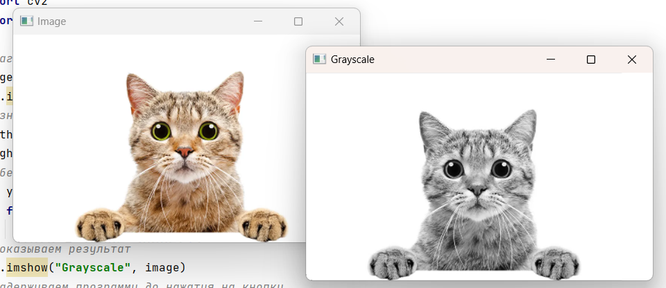
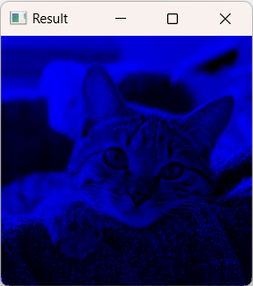
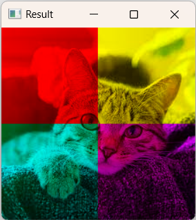

## Презентация

Слайд №1 - Название занятия, картинка 

Слайд №2 - Непонятные ползунки

На слайде скриншот 

И задание: Запустите программу `intro.py`. 

Поэкспериментируйте с ней и предложите хорошие названия вместо странных `v1`, `v2`, `v3`.

Слайд №3 - RGB-1 (red, green, blue)


Слайд №4 - RGB-2 (red, green, blue)


Слайд №5 - Работа с RGB в OpenCV

```python
# Grayscale вручную

import cv2
import numpy as np

# Загружаем и сразу показываем изображение
image = cv2.imread("pics/cat2.png")
cv2.imshow("Image", image)
# Узнаем его ширину и высоту
width = image.shape[1]
height = image.shape[0]
# Обесцвечиваем вручную
for y in range(height):
    for x in range(width):
        image[y, x] = int(np.average(image[y, x]))

# Показываем результат
cv2.imshow("Grayscale", image)

# Задерживаем программу до нажатия на кнопку
cv2.waitKey(0)
```



Слайд №6 - Работа с RGB в OpenCV

```python
# Загружаем и сразу показываем изображение
image = cv2.imread("pics/cat2.png")
cv2.imshow("Image", image)

image[:, ::3, 0] = 0
image[:, ::3, 1] = 0

image[:, 1::3,  1] = 0
image[:, 1::3, 2] = 0

image[:, 2::3, 0] = 0
image[:, 2::3, 2] = 0

# Показываем результат
cv2.imshow("RGB", image)
# Задерживаем программу до нажатия на кнопку
cv2.waitKey(0)
```


Слайд №7 - Разбор задания №1 Красный квадрат

```python
N = int(input())

image = np.zeros((N, N, 3), dtype=np.uint8)
image[:,:,2] = 255
cv2.imshow("Result", image)
cv2.imwrite("red.png", image)
# Задерживаем программу до нажатия на кнопку
cv2.waitKey(0)
```


Слайд №8 - Разбор задания №2 Синие очки
```python
# Загружаем изображение
image = cv2.imread("pics/cat1.jpg")

image[:, :, 1] = 0
image[:,:, 2] = 0

# или еще лучше - одной командой
#image[:,:, 1:] = 0

``` 


Слайд №9 - Разбор задания №3 Современный арт

```python
# Импортируем необходимое
import cv2

# Загружаем изображение
image = cv2.imread("pics/cat1.jpg")
wcenter = image.shape[1] // 2 # cередина по горизонтали
hcenter = image.shape[0] // 2 # серeдина по вертикали

image[:hcenter, :wcenter, :2] = 0 # "гасим" сразу два канала 
image[:hcenter, wcenter:, 0] = 0
image[hcenter:, wcenter:, 1] = 0
image[hcenter:, :wcenter, 2] = 0
```


Слайд №10 - HSV (Hue, Saturation, Value)


Слайд №10 - Подведение итогов

Что изучили, как изученное можно применить в проектах?
