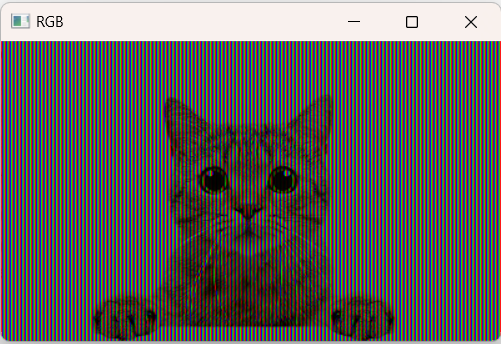

# Работа с цветом в ОpenCV

## Чему научимся

На этом занятии мы:
* Узнаем какие цветовые модели существуют и почему их несколько
* Научимся работать с цветовыми компонентами в OpenCV
* Используем технологию маскирования для выделения объектов по цвету

## Цветовая модель RGB

В модели RGB (аббревиатура английских слов red, green, blue — красный, зелёный, синий) цвет кодируется с помощью трёх цветов, которые принято называть основными. 

Выбор основных цветов обусловлен особенностями человеческого глаза. В отличие от большинства животных, 
у человека три базовых воспринимаемых цвета — красный, синий и зеленый, смешивая которые, получаются все цвета, видимые глазом.

При отсутствии излучения — нет никакого цвета — чёрный, смешение всех трёх при максимальных значениях даёт белый. 

Модель RGB аддитивна (слово "add" переводится как "сложить". Если цвет экрана, освещённого цветным прожектором, обозначается в RGB как (r1, g1, b1), а цвет того же экрана, освещённого другим прожектором, — (r2, g2, b2), то при освещении двумя прожекторами цвет экрана будет таким: (r1+r2, g1+g2, b1+b2).

 При смешении основных излучений, например, синего (B) и красного (R), получается пурпурный (M, magenta), зелёного (G) и красного (R) — жёлтый (Y, yellow), зелёного (G) и синего (B) — циановый (С, cyan). При смешении всех трёх основных излучений получается белый цвет (W, white).


В телевизорах и мониторах ЭЛТ применяются три электронных пушки для красного, зелёного и синего каналов. В ЖК- и других матричных мониторах и телевизорах носителями трёх цветов являются светоточки (светодиоды).


*Это RGB-экран под микроскопом*

## Работа c цветом в модели RGB

Загруженное в OpenCV Изображение в этой модели представляется трехмерным массивом:


Обычно компоненты цвета задаются числами от 0 до 255. При этом мы получаем $256^3 = 16777216$ различных цветов. Обычному глазу это более чем достаточно, больше он не сможет различить. 

Но, **внимание**! Порядок цветов другой BGR - цвета следуют в _обратном_ порядке. `image[:, :, 0]` соответствует плоскости _синей_ компоненты.

На самом деле мы всегда работали с трехмерным BGR-массивом, просто не обращали на это внимание. Например, команда `image[:, :4] = 0`, которая делает черными первых три строки пикселей изображения, на самом деле работает так: `image[:, :4, :] = 0`, то есть обращение происходит по всем элементам третьего измерения: красному, синему и зеленому, вернее, к синему, зеленому и красному. Если мы хотим обратиться только к зеленой компоненте пикселя с координатами `(x, y)`, то можем использовать конструкцию `image[y, x, 1]=...`. 

Например, если мы захотим обесцветить изображение, сделать его черно-белым с оттенками серого, то можно пробежаться по всем пикселям изображения и заменить все три значения на среднее:

Программа **example1.py**.

```python
import cv2
import numpy as np

# Загружаем и сразу показываем изображение
image = cv2.imread("pics/cat2.jpg")
cv2.imshow("Image", image)
# Узнаем его ширину и высоту
width = image.shape[1]
height = image.shape[0]
# Обесцвечиваем вручную
for y in range(height):
    for x in range(width):
        image[y, x] = int(np.average(image[y, x]))
# Показываем результат
cv2.imshow("Grayscale", image)
# Задерживаем программу до нажатия на кнопку
cv2.waitKey(0)
```


Кстати, обратите внимание, глаза остались зеленоватыми, а нос розовым. Почему?

А теперь сделаем эффект RGB: оставим в каждом столбце только синий, зеленый, красный и т.д.

```python
# RGB эффект

import cv2
import numpy as np

# Загружаем и сразу показываем изображение
image = cv2.imread("pics/cat2.png")
cv2.imshow("Image", image)

image[:, ::3, 0] = 0
image[:, ::3, 1] = 0

image[:, 1::3,  1] = 0
image[:, 1::3, 2] = 0

image[:, 2::3, 0] = 0
image[:, 2::3, 2] = 0

# Показываем результат
cv2.imshow("RGB", image)
# Задерживаем программу до нажатия на кнопку
cv2.waitKey(0)
```


Интересно, что этот рисунок состоит _только_ из зеленых, красных и синих точек, при этом мы отчетливо видим коричневые и серые цвета! Здесь отчетливо проявляется аддитивность: основные цвета складываются и образуют разные оттенки.

## Цветовая модель HSV

Несмотря на то, что RGB - это естественная модель, которая очень хорошо согласуется с устройством человеческого глаза, манипуляции с ней неочевидны. Действительно, совсем не интуитивно, что если отключить синий, то красный и зеленый в сумме дадут... желтый! 

Как например, осветлить изображение в модели? Нужно работать со всеми тремя компонентами, иначе поменяется оттенок.

Этих недостатков лишена цветовая модель HSV (Hue - Saturation - Value, на русский обычно переводится как Тон - Насыщенность - Яркость). 

Цвет в HSV задается тремя числами.

* **Hue** - _Цветовой оттенок._ задает собственно цвет: красный, оранжевый, голубой, зеленый, фиолетовый... 
* **Saturation** - _Насыщенность._ Представьте что в банку с краской добавляют белила - она становится светлее. Без добавления - зеленый. "Разбавили" - получили салатовый. Если добавить совсем много, то получится просто белый
* **Value** - _Яркость_. Представьте себе, что на полученную краску смотрят в комнате с освещением. Если свет очень яркий - видим краску, как она есть. При тусклом свете она выглядит темнее. Ну а если свет совсем выключить мы увидим только темноту, то есть черный.

Наглядно эту цветовую модель можно представить конусом.


По кругу - оттенки, вглубь - бледность оттенка, вверх - яркость. Внизу одна черная точка - все сходится туда.

## Работа с изображением в модели HSV

Сразу скажем, что минимальные и максимальные значения 

Все кажется намного сложнее, чем RGB. Но на практике работать с ней намного проще!

Например, для того, чтобы осветлить картинку, достаточно просто увеличить `V` у каждого пикселя.

Программа `example3.py`.

```python
# Осветление в HSV
import cv2
import numpy as np

# Загружаем и сразу показываем изображение
image = cv2.imread("pics/cat3.png")
cv2.imshow("Image", image)

# Переводим в HSV
image_hsv = cv2.cvtColor(image, cv2.COLOR_BGR2HSV)

# Увеличиваем яркость (третью компоненту)
image_hsv[:, :, 2] = np.clip(image_hsv[:,:,2].astype(np.int32) + 30, 0, 255)

# Переводим обратно в BGR
light_image = cv2.cvtColor(image_hsv, cv2.COLOR_HSV2BGR)

# Показываем результат
cv2.imshow("Lighten", light_image)
# Задерживаем программу до нажатия на кнопку
cv2.waitKey(0)
```

Строчка с увеличением яркости нуждается в пояснении.

```python
...
# Увеличиваем яркость (третью компоненту)
image_hsv[:, :, 2] = np.clip(image_hsv[:,:,2].astype(np.int32) + 30, 0, 255)
...

```

Вообще говоря, нам хочется сделать просто  
```python
image_hsv[:, :, 2] = image_hsv[:,:,2] + 30
``` 
Но преблема в том, что числа в массиве беззнаковые целые в диапазоне 0-255. И они зациклены. Например 255 + 1 это 0, 230 + 30 это не 260, а 260 - 255, то есть 5. Если преобразовать изображение таким образом, то ставшие очень светлыми пиксели, станут, наоборот, очень темными. Чтобы этого избежать мы:

* преобразуем массив к типу `np.int32`, чтобы прибавление 30 происходило как обычно: 250 + 30 = 280
* и потом функцией `np.clip()` - обрезаем полученные значения по границам 0-255. 

Таким образом, то, что больше 255, станет 255. А если затемнять, то есть вычитать, те значения, которые меньше нуля, останут нулями.  
